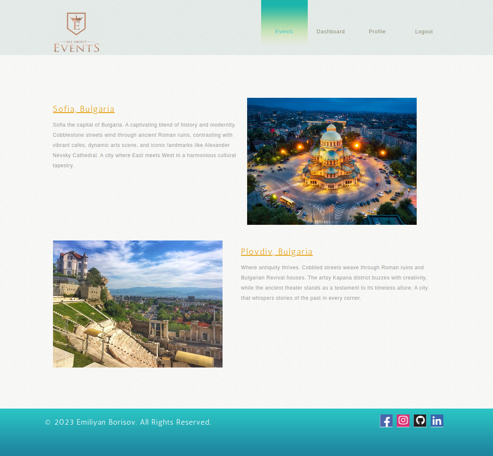
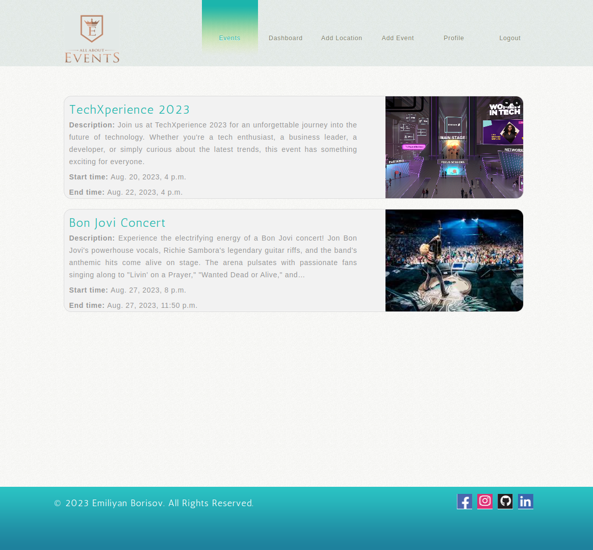
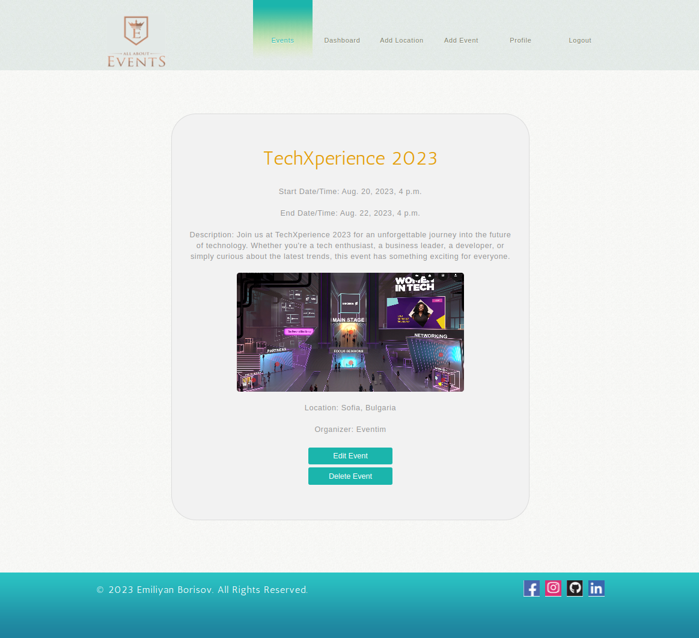
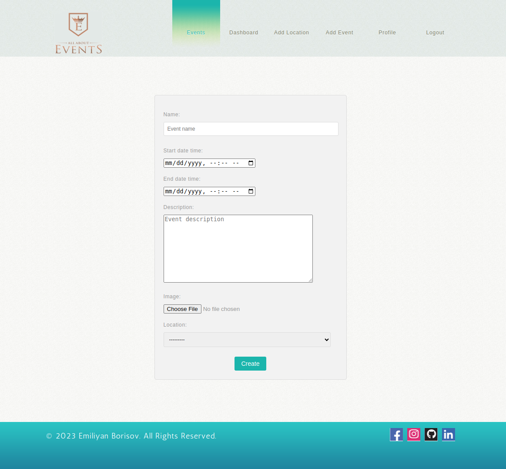

# Event Management System

The Event Management System is a robust and comprehensive web application designed to streamline the planning, organization, and execution of events. This platform offers a range of features that cater to both event organizers and attendees, creating a seamless and efficient experience for all

## Table of Contents

- [Introduction](#introduction)
- [Features](#features)
- [Technologies Used](#technologies-used)
- [Installation](#installation)
- [Usage](#usage)


## Introduction
The Event Management System aims to simplify event planning, event attendance, and provide a platform that fosters event organizers and attendees. Whether it's a small local gathering or a large-scale conference, the system enhances the efficiency, visibility, and overall experience of events.

## Features

- User registration and authentication
- Create, edit, and delete events
- Register for events
- View event details and location information
- Dashboard to manage your events
- Administrator Controls

## Technologies Used

- Django: Backend framework
- HTML/CSS: Frontend design
- PostgreSQL: Database management
- GitHub Actions: Continuous integration
- Bootstrap: UI components

## Installation

	1. Clone the repository:
   	```sh
	git clone https://github.com/Emiliyanbrsv/Web_python_final_exam.git
   
	2. Create a virtual environment and activate it:

	python -m venv venv
	source venv/bin/activate
	
	3. Install dependencies:
	
	pip install -r requirements.txt
	
	4. Create and apply migrations:
	
	python manage.py makemigrations
	python manage.py migrate
	
	5. Run the development server:
	
	python manage.py runserver
	
	6. Access the application in your browser at http://localhost:8000/

## Usage

- Index:


- Register Page:


- Dashboard:


- Event Details:


- Event Creation
- 


